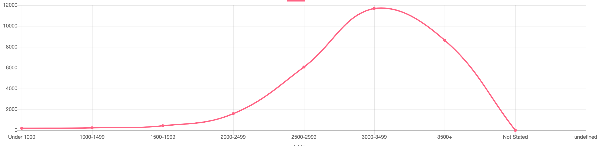

# Live infant birth weights by County (New York State) charted using Chart.js.

I knew I wanted to do something with live health data - and displaying that on charts. Particularly infant health/infant growth rate data, since this is something new parents are particularly concerned about. And it's also a measure of society's health.  Getting good quality, relevant data was hard. I looked through WHO, CDC, Data.gov, Computational Health Departments in Universities, NY State/City data. Some issues were old data, poorly structured (not JSON), below average documentation of API. I still persisted.

### Step 1 was to get data from tables, put into an array and learn Chart.js

The information in these arrays is typed


### Step 2: Learning to Configure options with Chart JS


### Step 3: The scope of the assignment was to work with live data using an API - luckily I found "Live Birth by Birth Weight" data, on NY State's Health Data site

I used "fetch" to get data from API URL, https://health.data.ny.gov/resource/b3b6-bu6t.json
and plotted it for Kings County - Brooklyn.

```markdown
,{"year":"2017","table":"11a","county":"Kings","category_description":"2500-2999","value":"7930"}
,{"year":"2017","table":"11a","county":"Kings","category_description":"3000-3499","value":"15891"}
,{"year":"2017","table":"11a","county":"Kings","category_description":"Not Stated","value":"4"}
,{"year":"2017","table":"11a","county":"Kings","category_description":"2000-2499","value":"1892"}
,{"year":"2017","table":"11a","county":"Kings","category_description":"Total","value":"39068"}
,{"year":"2017","table":"11a","county":"Kings","category_description":"1000-1499","value":"289"}
,{"year":"2017","table":"11a","county":"Kings","category_description":"1500-1999","value":"595"}
,{"year":"2017","table":"11a","county":"Kings","category_description":"Under 1000","value":"220"}
,{"year":"2017","table":"11a","county":"Kings","category_description":"3500+","value":"12247"}
```

### Step 4: Cleaning up data for graph (Chartjs)

Extracted data from JSON API was in descending order, and there was a Total's field at the end which didn't seem necessary, so I learned about cleaning and sorting arrays with pop() and reverse()

```markdown
weight.pop()
            births.pop()
            births.reverse()
            weight.reverse()
            addData(myChart, births)
```

and I learned how to update Chartjs with live data

```markdown
function addData(chart, data, label) {
            chart.data.labels.push(label);
            chart.data.datasets.forEach((dataset) => {
                dataset.data.push(data);
        });
            chart.update();
        }
```

#### Raw, unclean data


#### Clean sorted data


### Step 5: Making things scalable
Since I had prototyped on Kings County data by manually filtering for it
```markdown
// narrow to Brooklyn data, kingsCounty data is between 549-557
            for (var i=549; i < 558; ++i){
                kings.push(data[i])                 
            }
```
I wanted to showcase information from the rest of the counties,
this is where I spent a lot of time. Destructuring data and using it for the Chartjs system I had created was hard. First up, destructuring nested objects in an Array - and then using destructured data back in sorted Arrays to put in Chartjs was haaard. I tried many times and failed.

```markdown
//let's call this attempt #1 although it was probably #10
            // const [{county: county}, {category_description: weight}, {value: births }] = data 
//#11
            // weight = data.map(({category_description}) => weight)
//#12
            // births = data.map(({value}) => births)
//#16 using map function
// // weight = data[i].map(o => o.category_description)
 // // births = data[i].map(o => o.value)
```

it went on till i settled for a different approach of identifying indexes by County Name and pushing respective data in separate arrays. This seemed to work well.
```markdown
for (var i = 0; i < data.length; ++i){
                if (data[i].county == "Oneida"){
                    weight.push(data[i].category_description)
                    births.push(data[i].value)     
```

### Step 6: Creating a Drop Down
Creating a dropdown menu for county names and then updating chart based on selection began with removing repeat names in county array with use of Sets

```markdown
var countyAll = data.map(({county}) => county)
            let county = [...new Set(countyAll)];
```

Followed by

```markdown
 select = document.getElementById("selectCounty");
                for(var i = 0; i < county.length; i++) {
                     opt = county[i];
                     el = document.createElement("option");
                    el.textContent = opt;
                    el.text = opt;
                    select.appendChild(el);                                    
                }
```

Once a selection is made,  respective sets of data are created drawn in Chartjs

```markdown
//data created
for (var i = 0; i < data.length; ++i){
                if (data[i].county == "Oneida"){
                    weight.push(data[i].category_description)
                    births.push(data[i].value)    

```
Sadly, the part where selection text is passed to data sets being created is not working,

```markdown
console.log(document.getElementById("selectCounty").options[document.getElementById('selectCounty').selectedOptions].text)
```
but the over all logic works great!

## Queens


## Bronx


## Yates


Please see code here: https://github.com/bsehgol/dwd-api-nyc-health/blob/master/index5.html


